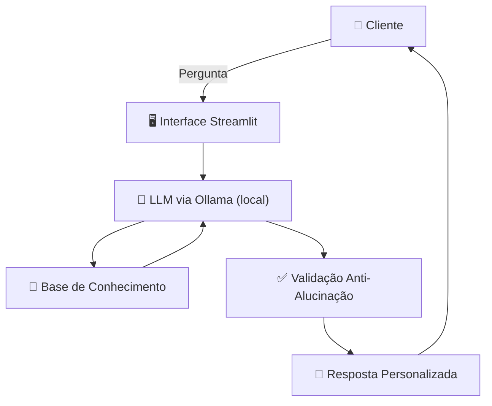

# 🎓 Edu — Educador Financeiro com IA Generativa

<p align="center">
  
  
  
  
  
</p>

> **"62% dos brasileiros não sabem o que é reserva de emergência."**
> O Edu é um agente de IA que ensina finanças pessoais de forma simples, personalizada e sem jargões — usando os dados do próprio cliente como exemplo prático.

---

## 📌 O Problema

Muitas pessoas querem aprender sobre finanças, mas...

- 😰 Têm medo de parecer "burras" fazendo perguntas básicas
- 🤯 Não sabem por onde começar
- 📚 O conteúdo disponível é genérico e difícil de aplicar à sua realidade

---

## 💡 A Solução: Edu

O **Edu** é um educador financeiro inteligente que:

- 🎯 **Personaliza** as explicações usando os dados reais do cliente
- 🧑‍🏫 **Educa** — não recomenda, não pressiona, não julga
- 🔒 **Roda 100% local** com Ollama, sem enviar dados para a nuvem
- 💬 Usa linguagem simples, como um professor particular disponível 24h

---

## 🏗️ Arquitetura



---

## 📁 Estrutura do Projeto

```
📁 lab-agente-financeiro/
│
├── 📄 README.md
│
├── 📁 data/
│   ├── historico_atendimento.csv     # Interações anteriores do cliente
│   ├── perfil_investidor.json        # Perfil, metas e objetivos
│   ├── produtos_financeiros.json     # Produtos disponíveis para ensino
│   └── transacoes.csv                # Extrato de transações do mês
│
├── 📁 docs/
│   ├── 01-documentacao-agente.md     # Caso de uso e persona
│   ├── 02-base-conhecimento.md       # Estratégia de dados
│   ├── 03-prompts.md                 # System prompt e exemplos
│   ├── 04-metricas.md                # Avaliação e resultados
│   └── 05-pitch.md                   # Roteiro do pitch
│
├── 📁 src/
│   └── app.py                        # Aplicação principal (Streamlit)
│
└── 📁 examples/
    └── README.md                     # Referências e exemplos
```

---

## 🚀 Como Rodar

### Pré-requisitos

- Python 3.10+
- [Ollama](https://ollama.com) instalado e rodando localmente

### 1. Instalar o modelo de linguagem

```bash
ollama pull gpt-oss
ollama serve
```

### 2. Instalar dependências Python

```bash
pip install streamlit pandas requests
```

### 3. Executar a aplicação

```bash
streamlit run src/app.py
```

Acesse em: [http://localhost:8501](http://localhost:8501)

---

## 🧠 Base de Conhecimento

O Edu utiliza quatro arquivos mockados para contextualizar suas respostas:

| Arquivo | O que contém | Como o Edu usa |
|--------|--------------|----------------|
| `perfil_investidor.json` | Nome, idade, renda, metas | Personaliza as explicações |
| `transacoes.csv` | Gastos e receitas do mês | Exemplos práticos de orçamento |
| `historico_atendimento.csv` | Atendimentos anteriores | Contextualiza o histórico do cliente |
| `produtos_financeiros.json` | Tesouro, CDB, LCI, FII... | Explica os produtos disponíveis |

---

## 🛡️ Segurança e Anti-Alucinação

O Edu foi projetado com regras claras para evitar informações incorretas:

- ✅ Responde **somente** com base nos dados fornecidos no contexto
- ✅ **Nunca** recomenda investimentos específicos — apenas explica como funcionam
- ✅ **Admite** quando não possui a informação solicitada
- ✅ **Recusa** perguntas fora do escopo financeiro educativo
- ✅ **Não acessa** dados bancários sensíveis (senhas, tokens, etc.)
- ✅ Executa **100% local**, sem envio de dados para servidores externos

---

## 💬 Exemplos de Interação

**Pergunta sobre conceito:**
> 👤 "O que é CDI?"
>
> 🤖 *"CDI é uma taxa de referência usada pelos bancos. Quando um investimento rende '100% do CDI', significa que ele acompanha essa taxa — hoje bem próxima da Selic. Quer que eu explique a diferença entre os dois?"*

**Pergunta com dados do cliente:**
> 👤 "Onde estou gastando mais?"
>
> 🤖 *"Olhando suas transações de outubro, sua maior despesa é moradia (R$ 1.380), seguida de alimentação (R$ 570). Juntas representam quase 80% dos gastos — isso é bem comum! Quer que eu explique estratégias de organização?"*

**Edge case — fora do escopo:**
> 👤 "Qual a previsão do tempo?"
>
> 🤖 *"Sou especializado em finanças e não tenho informações sobre previsão do tempo. Posso ajudar com algo relacionado às suas finanças?"*

---

## 📊 Métricas de Avaliação

| Métrica | O que avalia | Resultado |
|---------|--------------|-----------|
| **Assertividade** | Respondeu corretamente o que foi perguntado? | ✅ Aprovado |
| **Segurança** | Evitou inventar informações? | ✅ Aprovado |
| **Coerência** | Linguagem adequada ao perfil do cliente? | ✅ Aprovado |
| **Escopo** | Recusou perguntas fora do tema? | ✅ Aprovado |

---

## 🛠️ Tecnologias Utilizadas

| Categoria | Ferramenta |
|-----------|-----------|
| Interface | [Streamlit](https://streamlit.io/) |
| LLM (local) | [Ollama](https://ollama.com/) + gpt-oss |
| Dados | JSON + CSV (mockados) |
| Linguagem | Python 3.10+ |

---

## 📝 Documentação Completa

| Doc | Descrição |
|-----|-----------|
| [01 - Documentação do Agente](./docs/01-documentacao-agente.md) | Caso de uso, persona e arquitetura |
| [02 - Base de Conhecimento](./docs/02-base-conhecimento.md) | Estratégia de dados e integração |
| [03 - Prompts](./docs/03-prompts.md) | System prompt, exemplos e edge cases |
| [04 - Métricas](./docs/04-metricas.md) | Avaliação e resultados dos testes |
| [05 - Pitch](./docs/05-pitch.md) | Roteiro da apresentação |

---

## ⚠️ Limitações

- O Edu **não substitui** um profissional certificado (CFP, planejador financeiro)
- Os dados utilizados são **mockados** — não representam clientes reais
- O modelo local pode ter **latência maior** do que APIs em nuvem
- Sem memória entre sessões — cada conversa começa do zero

---

## 🎓 Contexto

Projeto desenvolvido como parte do desafio **"Agente Financeiro Inteligente com IA Generativa"** da [DIO](https://dio.me), com foco em:

- IA Generativa aplicada ao setor financeiro
- Engenharia de prompts
- Desenvolvimento de agentes com dados contextuais
- Anti-alucinação em domínios críticos

---

<p align="center">
  Feito com 💚 e muito aprendizado em finanças.
</p>
